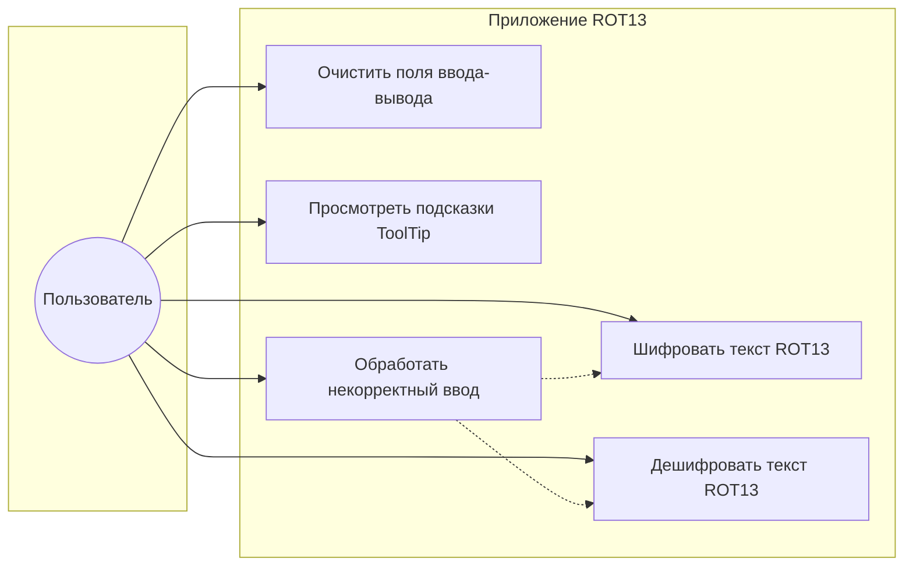

# П.2. Диаграмма вариантов использования (Use Case)

## Актёры

| Актёр | Описание |
|-------|----------|
| **Пользователь** | Оператор, вводящий текст и запускающий шифрование или дешифрование. |
| **Система** | Приложение ROT13 (модули шифрования, дешифрования, проверка ввода). |

## Диаграмма (UML, нотация PlantUML / Mermaid)

### Текстовое описание вариантов использования

| UC | Название | Основной поток | Альтернативы |
|----|----------|-----------------|--------------|
| UC1 | Шифровать текст | Пользователь вводит текст в поле открытого текста, нажимает «Зашифровать», система выводит ROT13-результат. | Пустой/пробельный ввод — предупреждение; превышение лимита длины — сообщение об ошибке. |
| UC2 | Дешифровать текст | Пользователь вводит «шифротекст», нажимает «Дешифровать», система выводит результат (для ROT13 совпадает с шифрованием). | Аналогично UC1. |
| UC3 | Очистить поля | Пользователь нажимает «Очистить всё», поля очищаются. | — |
| UC4 | Подсказки | Пользователь наводит курсор на элементы UI и читает ToolTip. | — |
| UC5 | Некорректный ввод | Система валидирует длину и пустоту, показывает диалоги без падения приложения. | Неожиданные исключения — общее сообщение об ошибке. |

## Связь с требованиями варианта 12

- Самодвойственность отражена тем, что UC1 и UC2 используют один алгоритм ROT13.
- «Только латиница» — правило преобразования в модуле ядра; прочие символы сохраняются (проверяется тестами и сценариями).
